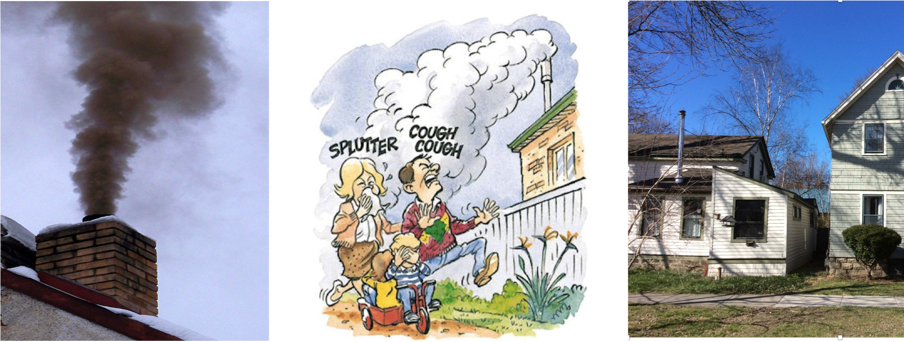
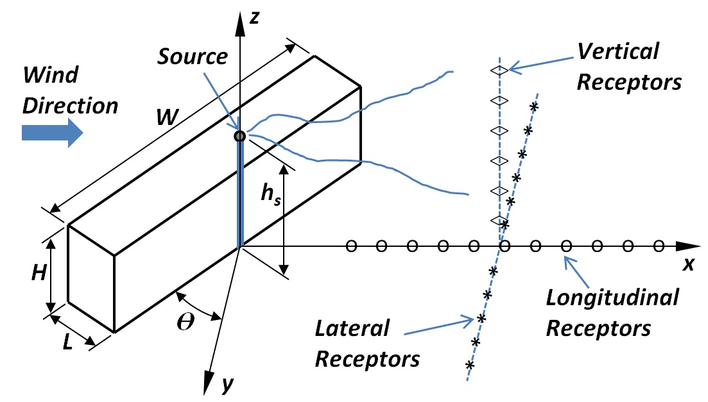
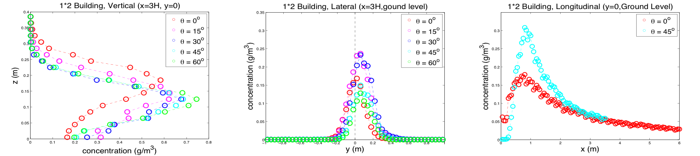

# jjgu1030-BDAOrg

## About Me

Coming from Shanghai, China, I am currently a 3rd year Ph.D. student working in the Energy and the Environment Research Lab with major in Mechanical Engineering at Cornell University. Before that, I got my bachelor's degree in Civil Engineering from Shanghai Jiao Tong University.

I have a background in structural engineering, fluid mechanics, probability and statistics, and modern machine learning techniques. I am passionate about being involved in different engineering projects, which serves the needs of the society as well as achieves my own value. And I believe that a refined science of engineering leads to the most efficient and environment-friendly solutions.

My Ph.D. project consists of two parts: source estimation and spatial variation. For emission sources with unknown emission rates and uncertain locations, the first part of my research is to estimate those source parameters by conducting ambient air quality measurements around the sources and applying source estimation algorithms. Once the sources are estimated, the second part of my research is to resolve the spatial variations of air pollutants in the nearby area. The specific project I am working on is to detect excessive woodsmoke sources and evaluate their impacts on the community. But the methodology can be applicable to many areas such as fugitive air emissions from oil and gas production, ship emissions in a port and small power plant emissions.

## Project Description

### Motivation

Residential wood smoke containing harmful fine particles and toxic air pollutants (benzene, formaldhyde, acrolein and polycyclic aromatic hydrocarbons, etc.) can cause severe health problems such as bronchitis and asthma (see the following pictures). Identification of emission sources and evaluation of their impacts are important to enforce local woodsmoke regulations. 

    
(Left: Black smoke from one stack; Middle: Cartoon of some health effects caused by the exposure to pollution from woodsmoke; Right: a house in Ithaca with the metal stack.)

### Problem Statement

US Environmental Protection Agency (USEPA) researchers did an extensive wind tunnel experiment recently (Perry et al., 2016), which simulated the building downwash in a controlled environment to examine the influence of elongated rectangular buildings on the near-field dispersion of pollutants released near and above the building (see the following sketch of wind tunnel experiment setup). 

(Sketch of the wind tunnel experiment setup)

The main objective is to quantify the source emission rate and determine the source location of the pollutants based on the downwind concentration measurement data (see the following examples of measurement data). After the source is identified, the second step is to predict the concentration profiles covering the whole domain of building downwind side. Data with different stack locations and heights (hs), different building aspect ratios (L*W) and different building angles with respect to the wind are to be used (θ).

(Wind tunnel measurements for 1*2 buildings with the 1.5H high stack located in the middle of the buiding downwind side)
